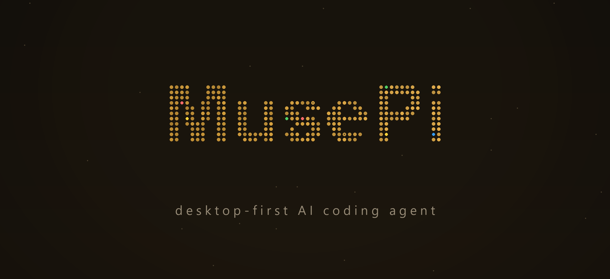

<p align="center">
  
</p>

<p align="center">
  <strong>MusePi</strong> — a desktop-first AI coding agent
</p>

<p align="center">
  <code>musepi</code> CLI · Electron desktop GUI · always-on desktop pet · daemon service
</p>

<p align="center">
  <a href="https://www.npmjs.com/package/@musepi/pi-coding-agent"></a>
  <a href="https://github.com/MuseLinn/MusePi/blob/main/packages/coding-agent/CHANGELOG.md"></a>
  <a href="https://github.com/MuseLinn/MusePi/actions"></a>
  <a href="https://github.com/MuseLinn/MusePi/blob/main/LICENSE"></a>
  <a href="https://www.typescriptlang.org"></a>
  <a href="https://www.rust-lang.org"></a>
  <a href="https://bun.sh"></a>
  <a href="https://discord.gg/4NMW9cdXZa"></a></p>

<p align="center">
  <em>中文版见 <a href="README.zh-CN.md">README.zh-CN.md</a></em>
</p>

---

MusePi is a **standalone coding-agent platform** with an **Electron desktop GUI, a daemon service, and an always-on desktop pet**. It shares an agent-engine lineage and keeps its own TUI command surface (`/` commands, `!`/`!!` shell, `@` file mentions, `#` references) wired into the GUI. **MusePi is its own upstream** — oh-my-pi / Pi / DSH / opencode etc. are reference sources absorbed on demand (see [UPSTREAM.md](UPSTREAM.md)).

Current app version **`0.4.3`** (independent of upstream versioning).

## Screenshots

| Welcome | Session | Settings |
|---|---|---|
|  |  |  |

## Features

### Desktop GUI

- **Electron desktop app** (`packages/gui`): three-pane layout (session sidebar + chat stream + context panel), Chinese-first UI, three-axis design tokens (theme / accent / density), frosted-glass vibrancy window.
- **Always-on desktop pet**: animated companion (petdex frame-animation packs, drag positioning, click-through, hover interactions, cross-window activity bridge); task progress surfaces as pet bubbles.
- **Daemon architecture**: the GUI talks JSON-RPC to the daemon (`musepi serve`). Sessions persist via journal + materialized view; idle 30-min sessions become history snapshots and reactivate on demand. The daemon survives GUI exit; reconnecting resumes.
- **Managed browser** (`browser.gui`): Electron `WebContentsView` + CDP bridge — drive an embedded browser page in the GUI with projected layout and pixel-sampled verification.
- **Integrated terminal**: xterm + bun-pty with tabs (middle-click close), hardened env (strips `ELECTRON_RUN_AS_NODE` etc.).
- **Full command surface (TUI parity)**: `/` slash commands (headless ACP executor), `!cmd`/`!!cmd` shell, `@` file mentions, `#` session references.
- **Context management**: context donut (`session.contextUsage`), `/compact`-parity manual compaction, snapcompact savings estimate.
- **Settings panel**: all 336 TUI settings merged into the desktop settings (schema-driven via `settings.schema`), 10+ tabs; sidebar search matches actual setting rows.
- **Rich interactions**: image attachments & lightbox, voice input (dictation / read-aloud / `tts.autoRead`), per-session draft persistence, idle recap, reminders panel, ⌘K command palette, Board kanban (auto-scaling canvas, ChromaGrid-style group glow), widget system (custom HTML widgets with theme hot-swap).
- **Presets (modes)**: named presets = extension whitelist + prompt sections + settings overrides (`~/.musepi/modes/<id>.json`); managed in Settings → 智能体 → 预设.
- **Session lifecycle status**: sidebar rows carry colored status squares (complete / interrupted / aborted / error / pending) with manual tag overrides.
- **Swarm task visualizer**: frosted member chip above the composer while a `task` tool runs — floating avatar/progress grid with agent trajectory drill-down.
- **Compaction status line**: agent status line swaps to a braille spinner + stop button while context compacts.
- **Model picker**: provider-qualified (`provider/id`) so two providers serving the same bare id never cross-light; session-scoped like the TUI `/switch`.
- **Dialogs & keyboard priority**: every confirm dialog plays enter/exit animations; modals own the keyboard while open (Escape closes, Enter confirms).
- **Relaunch experience**: differentiated splash hold, main-window bounds restore, last-session reopen on boot.
- **Right context panel**: file tree (PDF/image/text previews), Git changes & commits (gitmoji, GitHub device-flow auth), PR list, embedded browser, project notes + todos + plan files.
- **Subagent operations**: stop / revive / chat from the AgentsPanel (`agents.kill` / `agents.revive` / `agents.chat`).

### Core agent engine

- **40+ LLM providers**, 32 built-in tools, `xd://` device extensions.
- **LSP** wired into every write (renames, references, code actions); **DAP** debugger driving.
- **task subagents** (parallel fan-out, IRC coordination, worktree isolation), **hashline** content-hash edits, **hindsight** session memory, **ACP** editor-driven mode, **collab** sharing (self-hosted LAN/tunnel relays, plaintext guest mode).
- **snapcompact** compaction, **magic keywords** (ultrathink / orchestrate / workflowz), **TTSR** stream rules.

### Tools

31 tools live in the same namespace as `read` and `bash`. Pin the active set with `--tools read,edit,bash,…`; rarely used discoverable tools stay behind `xd://` devices (`read xd://` lists them).

**Files & search** — `read` (files, dirs, archives, SQLite, PDFs, notebooks, URLs, `ssh://`, internal `://` schemes) · `write` · `edit` (hashline patches) · `ast_edit` · `ast_grep` · `grep` · `glob`.

**Runtime** — `bash` (workspace shell, 46 in-process coreutils, optional PTY) · `eval` (persistent Python/JS cells).

**Code intelligence** — `lsp` (diagnostics, navigation, symbols, renames, code actions) · `debug` (DAP session) · `security_scan`.

**Coordination** — `task` (parallel subagent fan-out) · `hub` (agent messaging, job wait/cancel, process supervision) · `todo` · `ask`.

**Desktop & web** — `browser` (Puppeteer tabs over headless Chromium or your own Chrome via relay) · `computer` (host desktop: windows, screenshots, native input, AX tree) · `web_search` · `github` · `generate_image` · `inspect_image` · `tts`.

**Memory & skills** — `checkpoint` · `rewind` · `retain` · `recall` · `reflect` · `memory_edit` · `learn` · `manage_skill`.

Setting-gated, off by default: `github`, `security_scan`, `generate_image`, `tts`, `checkpoint`, `rewind`, and the memory tools (`retain`/`recall`/`reflect`/`memory_edit`, per `memory.backend`).

### Prompt & session controls

Three standalone lowercase words opt a turn into specialized behavior: **`ultrathink`** (careful multi-step reasoning), **`orchestrate`** (parallel subagents, verified phases), **`workflowz`** (deterministic multi-subagent workflow). See [Magic keywords](docs/magic-keywords.md).

Slash commands shift how a whole session runs (`/compact`, `/usage`, `/context`, `/fresh`, `/preset`, `/changelog`, …).
### Mobile shells

- **Capacitor Android app** (`packages/mobile` + `desktop-web` mobile entry): first-class phone UI sharing the collab web components — immersive edge-to-edge (custom `InsetsPlugin` for true status/nav bar heights), QR pairing via jsQR (no GMS dependency), time-aware greeting + rotating tips, suggestion chips, 44px tap targets, Android back-key layer unwinding, rotation transitions.
- **HarmonyOS WebView shell** (`packages/harmony`): ArkTS `Web` component loading the same bundle from rawfile — native insets (`getWindowAvoidArea`), badge, `musepi://` deep links, keyboard insets. No compat layer: immersion/camera/permissions are native.
- **PWA**: offline connect shell via service worker (`packages/desktop-web/public/sw.js`) — cached shell opens without a network; static assets cache-first.
- **Instance switcher**: top-bar menu connects to remote daemons (`serve --remote-token <token>` gates with bearer auth; hosts persist in localStorage).
- **Agent-initiated sharing**: the `collab` tool starts LAN/tunnel shares (tunnel requires explicit approval).
- **Pairing surface**: host shares via `/collab` (TUI slash: view / workspace / lan / tunnel / status / stop) or `collab.start` RPC; guests join with the collab link in any browser, the Android app, or `musepi join "<link>"` from the CLI. E2E-encrypted; workspace mode shares the whole session directory.
- Design spec: [`mobile-design.md`](docs/mobile-design.md).

## Providers

60+ providers, a thousand models, one `/model` away. Frontier APIs, coding plans, custom OpenAI-compatible providers, and four routing knobs (priority / cost / rate / fallback). Search providers (23 backends), specialised handlers, and security databases. Full provider & routing reference in `docs/`.

## Architecture

```
┌──────────────┐    JSON-RPC (collab-proto)    ┌──────────────────────┐
│  Electron GUI │ ◄────────────────────────────► │  musepi serve (daemon)│
│  packages/gui │   WS event stream (journal)   │  packages/coding-agent│
│  + desktop-web │                               │  AgentSession host    │
└──────┬───────┘                               └──────────┬───────────┘
       │                                                    │
       │  pet.html / bubble.html / pin.html                 │ agent engine
       │  (pet / bubble / pinned windows)                   ▼
       │                                         packages/agent · ai · tui
       │                                         natives (Rust N-API)
       ▼
  desktop-web: transcript / tool-render / widget / i18n (per-domain zh-CN/en-US maps)
```

| Package | Role |
|---|---|
| `gui` | Electron desktop app (main window + pet/bubble/pinned windows, xterm, pdf.js, managed-browser bridge) |
| `desktop-web` | GUI rendering core (transcript, tool cards, widget system, i18n) and the collab web UI (desktop + mobile entry) |
| `mobile` | Capacitor Android shell: InsetsPlugin (edge-to-edge), native chrome wiring, APK build |
| `harmony` | HarmonyOS NEXT WebView shell: ArkTS Web + `harmonyNative` bridge, deep links, DevEco project |
| `coding-agent` | CLI entry (`musepi`), daemon server, slash/bash commands, tool implementations |
| `collab-proto` | GUI ↔ daemon transport (WS frames, crypto, links) |
| `agent` / `ai` / `tui` / `catalog` / `wire` / `utils` / `hashline` / `snapcompact` / `mnemopi` / `stats` | Agent engine / provider registry / TUI / model catalog / wire types / utils |
| `sdk` | Client SDK (MaterializedView, session-stream event contract) |
| `natives` | Rust N-API bindings (Bazel/cargo builds, macOS LINKEDIT alignment post-processing) |
| `swarm-core` / `swarm-extension` / `tool-select` / `browser-relay` / `metaharness` | Subagent orchestration / tool selection / browser relay / harness tooling |

Key contract docs: [`gui-design.md`](docs/gui-design.md) · [`gui-implementation.md`](docs/gui-implementation.md) · [`widget-design-system.md`](docs/widget-design-system.md) · [`mobile-design.md`](docs/mobile-design.md) · [`collab.md`](docs/collab.md) · [`UPSTREAM.md`](UPSTREAM.md).

## Entry points

- **Interactive (TUI/CLI)**: `musepi` — the agent asks when in doubt, streams output, runs tools.
- **SDK — embed in Node**: `@musepi/pi-coding-agent` for programmatic sessions, streams, and tool hooks.
- **ACP / RPC**: editor-driven mode and JSON-RPC daemon for hosts / GUI / collab.

## Development

```sh
bun run setup            # install + natives build + link
bun run build            # workspace build (incl. GUI dist)
bun run check            # parallel check:ts (tsgo) + check:rs (cargo)
bun run test             # bun scripts/ci-test-ts.ts local
bun run lint / fmt       # biome + rustfmt
```

`bun setup` installs Bun workspaces and builds `@musepi/pi-natives`. Re-run `bun run build:native` after changing Rust crates or `packages/natives`. Nix users: `nix develop` → `bun setup` → `bun dev`.

## Packaging & Releases

### Desktop app (macOS)

```sh
bun --cwd=packages/gui run pack          # build + electron-builder + codesign
```

Produces `release/mac-arm64/MusePi.app`. The `pack` scripts ad-hoc sign the bundle so it runs locally. **Distribution builds** need a Developer ID Application certificate + notarization — macOS 26 refuses unsigned/non-notarized apps for several entitlements. See [`docs/macos-signing-notarization.md`](docs/macos-signing-notarization.md).

### CLI

`musepi update` self-updates the installed CLI; the release pipeline is on GitHub Actions (`ci.yml`, `gui-release.yml`).

## Documentation

- `docs/`: 95+ documents (GUI, providers, tools, hooks/extensions/skills, LSP/DAP, collab, compaction, ACP, settings, i18n, …)
- [`docs/gui-design.md`](docs/gui-design.md) / [`docs/gui-implementation.md`](docs/gui-implementation.md): GUI living docs (keep in sync with code changes)
- [`UPSTREAM.md`](UPSTREAM.md): archived oh-my-pi sync notes (reference-absorption history)

## Lineage & references

- [Upstream sync notes](UPSTREAM.md) · [Changelog](CHANGELOG.md) · [npm](https://www.npmjs.com/package/@musepi/pi-coding-agent) · [Discord](https://discord.gg/4NMW9cdXZa)
