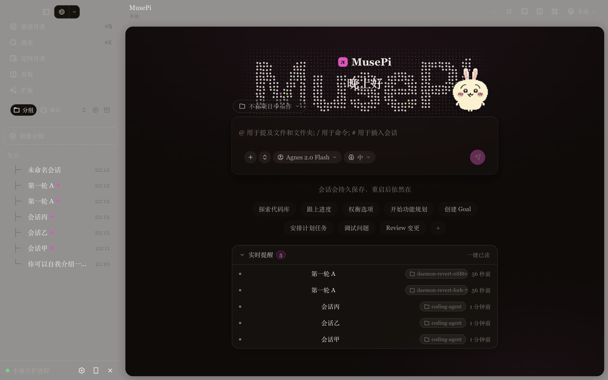
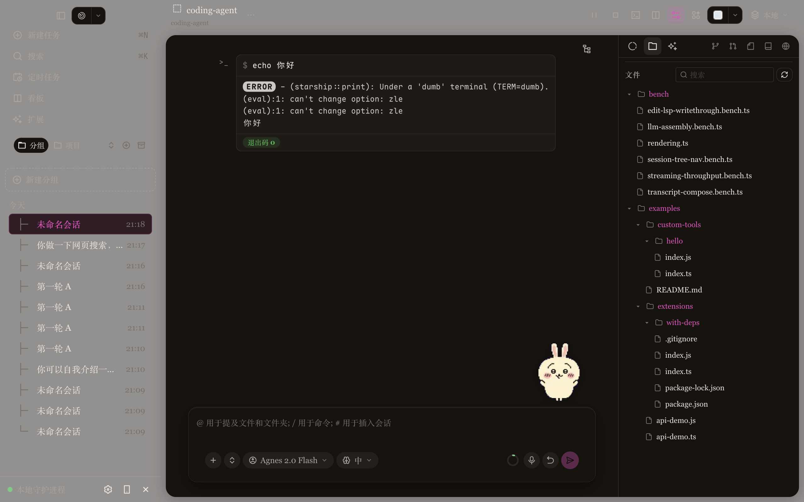
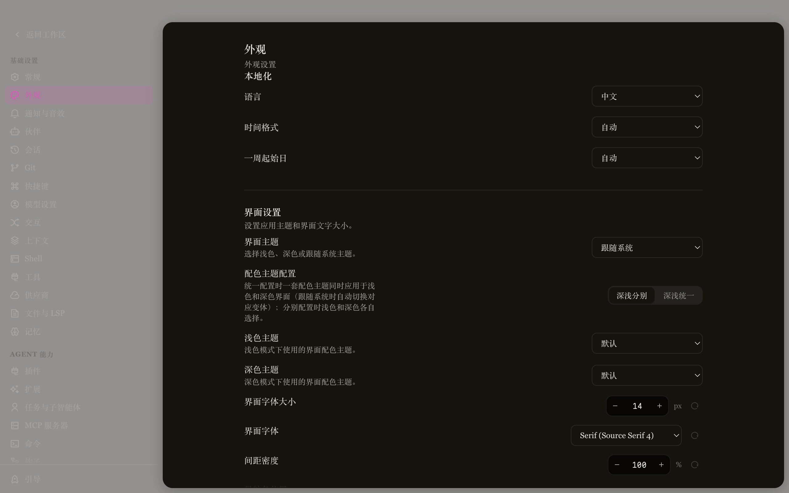

<p align="center">
  <strong>MusePi</strong> — a desktop-first AI coding agent
</p>

<p align="center">
  <code>musepi</code> CLI · Electron desktop GUI · always-on desktop pet · daemon service
</p>

<p align="center">
  <a href="https://www.npmjs.com/package/@musepi/pi-coding-agent"></a>
  <a href="https://github.com/MuseLinn/MusePi/blob/main/packages/coding-agent/CHANGELOG.md"></a>
  <a href="https://github.com/MuseLinn/MusePi/actions"></a>
  <a href="https://github.com/MuseLinn/MusePi/blob/main/LICENSE"></a>
  <a href="https://www.typescriptlang.org"></a>
  <a href="https://www.rust-lang.org"></a>
  <a href="https://bun.sh"></a>
  <a href="https://discord.gg/4NMW9cdXZa"></a></p>

<p align="center">
  <em>中文版见 <a href="README.zh-CN.md">README.zh-CN.md</a></em>
</p>

---

MusePi is a **standalone coding-agent platform** with an **Electron desktop GUI, a daemon service, and an always-on desktop pet**. It grew out of the [oh-my-pi](https://github.com/can1357/oh-my-pi) codebase (OMP; itself a fork of [Pi](https://github.com/badlogic/pi-mono)) — the inherited agent engine (40+ LLM providers, 32 built-in tools, LSP/DAP wiring, subagents, hashline, hindsight, ACP, collab) plus its own TUI command surface (`/` commands, `!`/`!!` shell, `@` file mentions, `#` references) are all wired into the GUI. **MusePi is its own upstream**: oh-my-pi / Pi / DSH / opencode / etc. are reference sources absorbed on demand (see [UPSTREAM.md](UPSTREAM.md)).

App version `0.4.2` (independent of upstream versioning; see [UPSTREAM.md](UPSTREAM.md)).

## Features

### Desktop GUI (the core delta vs. OMP)

- **Electron desktop app** (`packages/gui`): three-pane layout (session sidebar + chat stream + context panel), Chinese-first UI, three-axis design tokens (theme / accent / density), frosted-glass vibrancy window.
- **Always-on desktop pet**: an animated companion in the corner of the screen (petdex frame-animation packs, drag positioning, click-through, hover interactions, cross-window activity bridge); task progress surfaces as pet bubbles.
- **Daemon architecture**: the GUI talks JSON-RPC to the daemon (`musepi serve`). Sessions persist via journal + materialized view, idle 30 min sessions become history snapshots and reactivate on demand. The daemon survives GUI exit; reconnecting resumes.
- **Managed browser** (`browser.gui` tool): Electron `WebContentsView` + CDP bridge — the agent can drive an embedded browser page in the GUI, with projected layout and pixel-sampled verification.
- **Integrated terminal**: xterm + bun-pty with tabs (middle-click close), hardened env (strips `ELECTRON_RUN_AS_NODE` etc., injects `APPLE_SUPPRESS_DEVELOPER_TOOL_POPUP`).
- **Full command surface (TUI parity)**:
  - `/` slash commands: the daemon reuses the ACP headless executor (same builtin registry); `//` escapes to literal text; the welcome surface runs commands on session creation with pet-bubble + desktop-notification output.
  - `!cmd` / `!!cmd`: run shell commands (output fed to the model context; `!!` excludes it). The transcript renders a terminal-style bash card with an exit-code badge and collapsible output.
  - `@` file mentions: workspace-tree completion; the daemon's `extractFileMentions` injects file contents.
  - `#` session references: session-list completion that inserts `history://<id>` (a read-tool-resolvable internal URL).
- **Context management**: context donut (`session.contextUsage` live usage), `/compact`-parity manual compaction, snapcompact savings estimate (same planner as TUI `/context`).
- **Settings panel**: all 336 TUI settings merged into the desktop settings (schema-driven via the `settings.schema` RPC, same source of truth as the TUI), 10+ tabs; shared controls (toggle / segmented / select / masked credential inputs). The sidebar search matches actual setting rows (keyword-indexed, bilingual), highlights the matching rows in the content area and scrolls to the first one; role-model rows show each model's real thinking ladder (per-model `getSupportedEfforts`, not a fixed seven-rung list) and re-resolve auto-selection live when the DEFAULT role changes.
- **Rich interactions**: image attachments pre-scaled client-side (`images.autoResize` honored on both ends), image lightbox preview (multi-image stacks, zoom/pan), attachment keyboard deletion, voice input (dictation with live level/seconds feedback, read-aloud with per-message playing state, `tts.autoRead` auto-reading new replies), per-session draft persistence, idle recap (`recap.enabled`), reminders panel (live `working`/`live` session states), ⌘K command palette, Board kanban (canvas auto-scales to the window, no horizontal scrollbar, ChromaGrid-style group glow over the cards), widget system (custom HTML widgets with theme hot-swap).
- **Presets (modes)**: named presets = extension whitelist + prompt sections + settings overrides (`~/.musepi/modes/<id>.json`, built-in standard/minimal templates). The welcome composer's project row carries a preset chip (DSH 参考吸收); sessions show a read-only preset label. CLI/TUI: `--preset <id>` at startup, `/preset` to inspect. Managed in Settings → 智能体 → 预设 (card panel with validate/delete; `modes.validate` for agent self-checks). Extension center splits **OMP Extension Packages** (upstream ecosystem) and **MusePi Extensions** (own extension system) into separate tabs.
- **Session lifecycle status** (TUI session-list parity): every sidebar row carries a colored status square (complete / interrupted / aborted / error / pending, from the session-file tail) with a manual tag override via the row context menu (`#完成`/`#中断`/…); group member rows pin working/unread sessions first. Archived snapshots are normalized to idle, so a daemon shut down mid-stream never leaves a phantom "working" turn with an unstoppable stop button.
- **Swarm task visualizer** (kimiwork parity): while a `task` tool runs, a frosted member chip hovers above the composer (`display.taskCardStyle=swarm`) — click opens the floating avatar/progress grid (agent trajectory drill-down); the transcript keeps compact one-line-per-subagent rows.
- **Compaction status line**: the agent status line swaps to a braille spinner + stop button while the context compacts (daemon `isCompacting`), cancel via `session.abort` (TUI Esc parity).
- **Model picker**: favorites / the DEFAULT pin / the current selection are provider-qualified (`provider/id`) — two providers serving the same bare id (e.g. opencode-go vs opencode-zen both offering deepseek-v4-flash) never cross-light each other; the composer + welcome composer can pin any model as the new-session default (target button) without opening settings. Picks are session-scoped like the TUI `/switch` (`session.setModel` — one session's choice never leaks into another's composer or new-session creation), and the welcome composer always rests on the DEFAULT model (`modelRoles.default`), refreshing live when the DEFAULT changes.
- **Dialogs & keyboard priority**: every confirm dialog plays enter/exit animations (DialogFrame two-phase; prompt/confirm boxes got the same motion), modals own the keyboard while open — Escape closes, Enter confirms/advances, focus moves into the dialog and is restored on close; the onboarding overlay advances on Enter and steps back / closes on Escape; a kimiwork-style 新建空白项目 dialog (name + parent path → daemon `fs.mkdir` → open) is available from the sidebar 项目 tab and the composer's project menu.
- **Relaunch experience**: differentiated splash hold (warm relaunch ~1.1s vs cold 2s), main-window bounds restore (`main-window.json`, work-area clamped, drag/resize debounced), last-session reopen on boot (failed opens never poison the stored id).
- **Right context panel**: file tree (PDF/image/text previews, open-in-system), Git changes & commits (gitmoji, identity injection, GitHub device-flow auth), PR list, embedded browser (viewport presets, element picking), project notes + todos + plan files.
- **Subagent operations** (Agent Hub parity): stop / revive / chat from the AgentsPanel (`agents.kill` / `agents.revive` / `agents.chat` RPC).

### Inherited from the OMP lineage (oh-my-pi / Pi)

- **40+ LLM providers**, 32 built-in tools, `xd://` device extensions, continuously tuned prompts.
- **LSP** wired into every write (renames, references, code actions); **DAP** debugger driving.
- **task subagents** (parallel fan-out, IRC coordination, worktree isolation, schema-validated outputs), **hashline** content-hash edits, **hindsight** session memory, **ACP** editor-driven mode, **collab** sharing (with musepi extras: self-hosted LAN/tunnel/Tailscale-serve relays, plaintext guest mode).
- **snapcompact** compaction (dense bitmap frames for vision models), **magic keywords** (ultrathink / orchestrate / workflowz), **TTSR** stream rules.

## Screenshots

| Welcome | Session | Settings |
|---|---|---|
|  |  |  |

```sh
bun install -g @musepi/pi-coding-agent
```

**Windows (PowerShell)**
Requires **Bun ≥ 1.3.14** (macOS is the primary development platform; Rust toolchain needed for natives builds). Full setup (pull, reference checkouts for `harness-engineering/`, natives notes): **[docs/windows-development.md](docs/windows-development.md)**.

### Development mode

```sh
# Install deps + build natives + link the CLI
bun run setup

# Terminal TUI (upstream CLI surface)
bun run musepi          # or: bun run dev

# Daemon service (GUI backend; also auto-started by the GUI)
bun --cwd=packages/coding-agent src/cli.ts serve --port 8300

_[Watch the capture ↗](https://omp.sh/clips/codemod.mp4)_

### 20 · Drives a _real browser_. _Or your Slack?_

Stealth's on by default, so pages see a normal user instead of a headless bot. The same API drives any Electron app in place — point it at Slack and the agent reads your DMs the way it reads the web. Or skip the sandbox entirely: the browser relay extension lets the agent adopt the Chrome tabs you already have open, without stealing focus.


### 21 · Hands on the desktop itself

`computer` runs persistent JavaScript against the real host: enumerate windows and displays, capture screenshots, send native input, walk the OS accessibility tree, touch the clipboard. Not the browser tool, no DOM — the same desktop you're looking at.

## Whatever the task needs, _it's already in the box_.

31 tools live in the same namespace as `read` and `bash`. Pin the active set with `--tools read,edit,bash,…`; rarely used discoverable tools stay behind `xd://` devices. `read xd://` lists them, and `write xd://<tool>` runs one when `tools.xdev` is enabled.

**Files & search**

- `read` — files, dirs, archives, SQLite, PDFs, notebooks, URLs, remote `ssh://` paths, and internal `://` schemes through one path.
- `write` — create or overwrite a file, archive entry, or SQLite row.
- `edit` — hashline patches with content-hash anchors and stale-anchor recovery.
- `ast_edit` — structural rewrites previewed before apply, via ast-grep.
- `ast_grep` — structural code queries over 50+ tree-sitter grammars.
- `grep` — regex over files, globs, and internal URLs.
- `glob` — glob-based path lookup; reach for `grep` when you need content matches.

**Runtime**

- `bash` — workspace shell with 46 in-process coreutils, optional PTY, and background-job dispatch.
- `eval` — persistent Python and JavaScript cells with shared prelude and tool re-entry.

**Code intelligence**

- `lsp` — diagnostics, navigation, symbols, renames, code actions, raw requests.
- `debug` — drive a DAP session — breakpoints, stepping, threads, stack, variables.
- `security_scan` — plan and run native security reviews; drives Codex Security cloud scans.

**Coordination**

- `task` — fan out subagents in parallel, optionally workspace-isolated.
- `hub` — message live agents, wait on or cancel background jobs, and supervise long-running processes.
- `todo` — ordered mutations over the session todo list with phase tracking.
- `ask` — structured follow-up questions for interactive runs.

**Desktop & web**

- `browser` — Puppeteer tabs over headless Chromium, CDP-attached apps, or your own Chrome via the relay.
- `computer` — persistent JS against the host desktop: windows, screenshots, native input, AX tree, clipboard.
- `web_search` — one query across configured providers, returning answer plus citations.
- `github` — GitHub CLI ops — repo, PR, issues, code search, Actions run-watch.
- `generate_image` — generate or edit raster images via Gemini, GPT, or xAI Grok image models.
- `inspect_image` — vision-model analysis of a local image file.
- `tts` — text-to-speech via xAI Grok Voice — five built-in voices, WAV or MP3.

**Memory & skills**

- `checkpoint` — mark conversation state for a later collapse-and-report.
- `rewind` — prune exploratory context, keep a concise report.
- `retain` — queue durable facts into the active memory bank.
- `recall` — search the memory bank for raw memories.
- `reflect` — synthesize an answer over the bank.
- `memory_edit` — update, forget, or invalidate stored memories by id.
- `learn` — capture a reusable lesson; optionally promote it into a managed skill.
- `manage_skill` — create, update, or delete an isolated managed skill.

Setting-gated, off by default: `github`, `security_scan`, `generate_image`, `tts`, `checkpoint`, `rewind`, and the memory tools (`retain`/`recall`/`reflect`/`memory_edit`, per `memory.backend`). `inspect_image` activates automatically when the active model can't see.

[Full reference →](https://omp.sh/docs/tools)

### Prompt controls

Three standalone, lowercase words opt a turn into specialized agent behavior:

- `ultrathink` — request careful multi-step reasoning and the highest supported automatic thinking effort.
- `orchestrate` — run substantial independent work through parallel subagents and verify each phase.
- `workflowz` — build a deterministic multi-subagent workflow with the active `task` tool.

They trigger only in prose, not inside code spans, fenced code blocks, XML/HTML sections, identifiers, or paths. See [Magic keywords](docs/magic-keywords.md) for exact matching rules and configuration.

### Session controls

Slash commands shift how a whole session runs:

- `/vibe` — enter [Vibe mode](docs/vibe-mode.md): act as a director driving persistent `fast`/`good` worker sessions with a `read`-only toolset.
- `/fresh` — reset the provider stream state (stale prompt cache, wedged stream) without changing the local transcript. See [Session operations](docs/session-operations-export-share-fork-resume.md#fresh).

## Sixty-plus providers, a thousand models, _one /model away_.

Ten roles route work by intent. `default` for normal turns. `smol` for cheap subagent fan-out. `slow` for deep reasoning. `plan` for plan mode. `commit` for changelogs. Plus `vision`, `designer`, `task`, `advisor`, and `tiny` for their namesakes. Override at launch with `--smol`, `--slow`, or `--plan`; cycle through the configured models for the active role with `Ctrl+P`. Swap the active model mid-session with the `/model` slash command.

Auth tags below: `oauth` signs in with your provider account, `plan` routes through a coding-plan subscription, `local` runs against a local server with the key optional.

### Frontier APIs

Direct APIs and gateways. Mix providers per role.

Anthropic `oauth` · OpenAI · OpenAI Codex `oauth` · Google Gemini · Google Vertex · Google Antigravity `oauth` · xAI · SuperGrok `oauth` · DeepSeek · Mistral · Groq · Cerebras · Fireworks · Together · Baseten · Hugging Face · NVIDIA · Meta · Amazon Bedrock · Azure OpenAI · SiliconFlow · GMI Cloud · CoreWeave · Sakana AI · OpenRouter · Synthetic · Vercel AI Gateway · Cloudflare AI Gateway · Wafer Serverless

### Coding plans

Subscription-routed. `/login` attaches the session.

Cursor `oauth` · GitHub Copilot `oauth` · GitLab Duo · Devin `oauth` · Kimi Code `plan` · Moonshot · MiniMax Coding Plan `plan` · MiniMax Coding Plan CN `plan` · Alibaba Coding Plan `plan` · Qwen Portal `oauth` · Z.AI / GLM Coding Plan `plan` · Zhipu Coding Plan `plan` · Xiaomi MiMo · Qianfan · Umans `plan` · NanoGPT · Novita · Venice · Kilo · ZenMux · OpenCode Go · OpenCode Zen

### Run it yourself

OpenAI-compatible `/v1/models`. Local instances skip the key.

Ollama `local` · Ollama Cloud · LM Studio `local` · llama.cpp `local` · vLLM `local` · LiteLLM

### Custom OpenAI-compatible providers

Define custom providers in `~/.omp/agent/models.yml`:

```yaml
providers:
  spark:
    baseUrl: http://192.168.10.223:8000/v1
    api: openai-completions
    apiKey: dummy
    models:
      - id: minimax-m3
        name: MiniMax M3
        contextWindow: 100000
        maxTokens: 32000
```

Run `omp models spark` to verify discovery. Then run `omp setup` and choose the model in the default-model step, or open `/model` in a session and assign it to the `default` role.

To preconfigure the default without the picker, add the selector to `~/.omp/agent/config.yml`:

```yaml
modelRoles:
  default: spark/minimax-m3
```

### Four knobs that make routing useful

- **Custom providers** — Declare anything that speaks `openai-completions`, `openai-responses`, `openai-codex-responses`, `azure-openai-responses`, `anthropic-messages`, `bedrock-converse-stream`, `google-generative-ai`, `google-gemini-cli`, or `google-vertex` in `~/.omp/agent/models.yml`.
- **Fallback chains** — Per-role or per-model chains under `retry.fallbackChains`. When the primary throws 429s or hits a quota wall, the next entry takes the rest of the turn — restored on cooldown.
- **Path-scoped models** — Scope `enabledModels` and `disabledProviders` entries to a `path:` prefix to pin a different model set on one repo without touching the global config. Scoped entries cover the path and everything under it.
- **Round-robin credentials** — Stack API keys per provider and the runtime rotates with session affinity and per-credential backoff. Useful when one key would burn its quota by lunch.

Full provider & routing reference at [omp.sh/docs/providers](https://omp.sh/docs/providers).

## Twenty-three backends. _One tool the agent already knows_.

`web_search` is built in, not bolted on. `auto` walks a twenty-three-provider chain; pin one by name if you already pay for it. Behind every hit, site-aware extraction turns GitHub, registries, arXiv, Stack Overflow, and docs into structured markdown — anchors and link targets survive.

### Search providers

Twenty-three backends. Pin one, or let `auto` walk the chain in order.

| provider     | auth                                      |
| ------------ | ----------------------------------------- |
| `auto`       | chain                                     |
| `perplexity` | `PERPLEXITY_API_KEY` (anonymous fallback) |
| `gemini`     | oauth                                     |
| `anthropic`  | oauth                                     |
| `codex`      | oauth                                     |
| `xai`        | oauth or `XAI_API_KEY`                    |
| `zai`        | `ZAI_API_KEY`                             |
| `exa`        | `EXA_API_KEY` (or mcp)                    |
| `tinyfish`   | `TINYFISH_API_KEY`                        |
| `jina`       | `JINA_API_KEY`                            |
| `kagi`       | `KAGI_API_KEY`                            |
| `tavily`     | `TAVILY_API_KEY`                          |
| `firecrawl`  | `FIRECRAWL_API_KEY` (keyless fallback)    |
| `brave`      | `BRAVE_API_KEY`                           |
| `kimi`       | `/login kimi-code` or search key          |
| `parallel`   | `PARALLEL_API_KEY`                        |
| `synthetic`  | `SYNTHETIC_API_KEY`                       |
| `searxng`    | self-hosted                               |
| `duckduckgo` | no key                                    |
| `startpage`  | no key                                    |
| `google`     | no key (browser)                          |
| `ecosia`     | no key (browser)                          |
| `mojeek`     | no key (browser)                          |
| `public`     | no key (all of the above, consolidated)   |

Exa also accepts a stored API key through `/login exa`; explicit keyless selection uses the public MCP fallback.

### Specialised handlers

The agent gets structured content, not stripped HTML.

- **Code hosts** — github, gitlab
- **Package registries** — npm, PyPI, crates.io, Hex, Hackage, NuGet, Maven, RubyGems, Packagist, pub.dev, Go packages
- **Research sources** — arxiv, semantic scholar
- **Forums** — stack overflow, reddit, hn
- **Docs** — mdn, readthedocs, docs.rs

Pages convert to markdown with link structure intact. The agent can cite, follow, and quote without losing anchors.

### Security databases

Vuln lookups answer with vendor data, not blog summaries.

- **NVD** — national vulnerability database
- **OSV** — open source vuln feed
- **CISA KEV** — known exploited vulns

[`web_search` reference ↗](https://omp.sh/docs/tools#web_search)

## Roughly **~80,000** lines of Rust, doing the work other harnesses shell out for.

Six crates, one platform-tagged N-API addon. Search, shell, AST, highlight, PTY, desktop control, image decode, BPE counting — all in-process on the libuv pool. No fork/exec on the hot path. Another ~80k lines ride along vendored: the brush bash fork, plus 58 command-line utilities — coreutils, findutils, sed, jq, ripgrep-backed grep, fd, diff, moreutils — ported into the builtins crate and compiled straight into the shell.

- Crates: `pi-natives`, `pi-shell`, `pi-ast`, `pi-iso`, `pi-voice`, `pi-walker`
- Platforms: `linux-x64`, `linux-arm64`, `darwin-x64`, `darwin-arm64`, `win32-x64` — x64 ships dual AVX2 and baseline binaries

Per crate, code lines only:

| Crate         | What it does                                                                           |   ~LoC |
| ------------- | -------------------------------------------------------------------------------------- | -----: |
| pi-shell      | Embedded bash engine · persistent sessions · in-process coreutils dispatch · minimizer | 38,000 |
| pi-natives    | The N-API surface — every module in the table below                                    | 25,000 |
| pi-walker     | Parallel ignore-aware walker + scan cache shared by grep · glob · workspace · shell    |  5,200 |
| pi-iso        | Workspace isolation · apfs · btrfs · zfs · reflink · overlayfs · projfs · rcopy        |  3,300 |
| pi-ast        | tree-sitter + ast-grep matching, block resolution, structural summaries                |  2,900 |
| pi-voice      | Audio capture/playback · Opus · live WebRTC                                            |  1,000 |

Inside `pi-natives`, the per-module breakdown (glue and tests omitted):

| Module        | What it does                                                                      | Powered by                                |   ~LoC |
| ------------- | --------------------------------------------------------------------------------- | ----------------------------------------- | -----: |
| desktop       | Window/display enumeration · screenshot · native input · AX tree for `computer`   | xcap · enigo · OS AX FFI                  | 10,600 |
| grep          | Regex search · parallel/sequential · glob & type filters · fuzzy find             | grep-regex · grep-searcher                |  3,280 |
| text          | ANSI-aware width · truncation · column slicing · SGR-preserving wrap              | unicode-width · segmentation              |  2,070 |
| snapcompact   | Bitmap-frame rasterization + PNG encode for context compression                   | image · png                               |  1,760 |
| keys          | Kitty keyboard protocol with xterm fallback · PHF perfect-hash lookup             | phf                                       |  1,740 |
| ast           | ast-grep pattern matching and structural rewrites                                 | ast-grep-core                             |  1,510 |
| diff          | Structured file diffing for tools and previews                                    | in-tree                                   |  1,030 |
| pty           | Native PTY allocation for sudo · ssh interactive prompts                          | portable-pty                              |    630 |
| crash_handler | Native crash capture and reporting                                                | in-tree                                   |    610 |
| highlight     | Syntax highlighting · 11 semantic categories · 30+ aliases                        | syntect                                   |    550 |
| appearance    | Mode 2031 + native macOS dark/light via CoreFoundation FFI                        | core-foundation                           |    450 |
| task          | Blocking work on libuv thread pool · cancellation · timeout · profiling           | tokio · napi                              |    440 |
| glob          | Discovery with glob · type filters · mtime sort · gitignore respect               | ignore · globset                          |    430 |
| fd            | Filesystem walker for find-tool replacement                                       | ignore                                    |    385 |
| clipboard     | Text copy and image read from system clipboard · no xclip/pbcopy                  | arboard                                   |    370 |
| workspace     | Workspace walker with gitignore + AGENTS.md discovery in one pass                 | ignore                                    |    275 |
| power         | macOS power-assertion API for idle/system/display-sleep prevention                | IOKit FFI                                 |    270 |
| prof          | Circular buffer profiler with folded-stack and SVG flamegraph output              | inferno                                   |    240 |
| file_lock     | Cross-process advisory file locking                                               | in-tree                                   |    210 |
| ps            | Cross-platform process-tree kill and descendant listing                           | libc · libproc · CreateToolhelp32Snapshot |    195 |
| tokens        | O200k / Cl100k BPE token counting · both tables embedded                          | tiktoken-rs                               |     70 |
| html          | HTML to Markdown with optional content cleaning                                   | html-to-markdown-rs                       |     60 |
| sixel         | Terminal image rendering · decode PNG · JPEG · WebP · GIF · resize · SIXEL encode | icy_sixel · image                         |     55 |

## Four entry points: _interactive_, _one-shot_, RPC, and ACP.

Same engine, four wrappers. `omp` runs the TUI. `omp -p` answers a single prompt and exits. The Node SDK embeds the session in your process. `omp --mode rpc` and `omp acp` hand the wheel to another program over stdio.

### Interactive — when in doubt, the agent asks

The TUI is the default surface. Tool calls render as cards, edits preview before they land, and ambiguity routes through the `ask` tool — a structured option picker the agent can call mid-turn. The keyboard handles the rest.

The same prompt cards surface over ACP, so editors get the picker without writing one.


### SDK — embed in Node

`@musepi/pi-coding-agent`

Node and TypeScript hosts pull the engine in directly. The package exposes `ModelRegistry`, `SessionManager`, `createAgentSession`, and `discoverAuthStorage`; the session emits typed events you subscribe to.

```ts
import {
  ModelRegistry,
  SessionManager,
  createAgentSession,
  discoverAuthStorage,
} from "@musepi/pi-coding-agent";

const auth = await discoverAuthStorage();
const models = new ModelRegistry(auth);
await models.refresh();

const { session } = await createAgentSession({
  sessionManager: SessionManager.inMemory(),
  authStorage: auth,
  modelRegistry: models,
});
await session.prompt("list .ts files");```

`musepi` subcommands inherit OMP: `launch` (default chat), `serve` (daemon), `acp`, `agents`, `commit`, `config`, `join`, `models`, `plugin`, `say`, `share`, `setup`, `shell`, `stats`, `update`, `completions`, …

Config lives under `~/.musepi/` (branding delta; override with `PI_CONFIG_DIR`).

## Architecture

```
┌──────────────┐    JSON-RPC (collab-proto)    ┌──────────────────────┐
│  Electron GUI │ ◄────────────────────────────► │  musepi serve (daemon)│
│  packages/gui │   WS event stream (journal)   │  packages/coding-agent│
│  + desktop-web │                               │  AgentSession host    │
└──────┬───────┘                               └──────────┬───────────┘
       │                                                    │
       │  pet.html / bubble.html / pin.html                 │ agent engine
       │  (pet / bubble / pinned windows)                   ▼
       │                                         packages/agent · ai · tui
       │                                         natives (Rust N-API)
       ▼
  desktop-web: transcript / tool-render / widget / i18n (per-domain zh-CN/en-US maps)
```

| Package | Role |
|---|---|
| `gui` | Electron desktop app (main window + pet/bubble/pinned windows, xterm, pdf.js, managed-browser bridge) |
| `desktop-web` | GUI rendering core (transcript, tool cards, widget system, i18n) and the collab web UI |
| `coding-agent` | CLI entry (`musepi`), daemon server, slash/bash commands, tool implementations |
| `collab-proto` | GUI ↔ daemon transport (WS frames, crypto, links) |
| `agent` / `ai` / `tui` / `catalog` / `wire` / `utils` / `hashline` / `snapcompact` / `mnemopi` / `stats` | Upstream-derived engine / provider registry / TUI / model catalog / wire types / utils |
| `sdk` | Client SDK (MaterializedView, session-stream event contract) |
| `natives` | Rust N-API bindings (Bazel/cargo builds, macOS LINKEDIT alignment post-processing) |
| `swarm-core` / `swarm-extension` / `tool-select` / `browser-relay` / `metaharness` | Subagent orchestration / tool selection / browser relay / harness tooling |

Key contract docs:

- **GUI design spec**: `docs/gui-design.md` (layout / tokens / motion / component patterns / pet visual style)
- **GUI implementation notes**: `docs/gui-implementation.md` (daemon RPC shapes, IPC, pitfalls, verification workflows)
- **Widget design system**: `docs/widget-design-system.md`
- **Collab**: `docs/collab.md` (incl. musepi LAN/tunnel extras)
- **Upstream sync**: `UPSTREAM.md` (baseline v17.2.12, PURE/THREE_WAY/NEW/MANUAL classification, verification records)

## Development

```sh
bun run setup            # install + natives build + link
bun run build            # workspace build (incl. GUI dist)
bun run check            # parallel check:ts (tsgo) + check:rs (cargo)
bun run test             # bun scripts/ci-test-ts.ts local
bun run lint / fmt       # biome + rustfmt
```

`bun setup` installs Bun workspaces and builds `@musepi/pi-natives`. Re-run `bun run build:native` after changing Rust crates or `packages/natives`.

Nix users get the pinned Bun and Rust toolchains plus all native build dependencies:

```sh
nix develop
bun setup
bun dev
```

Build and smoke-test the distributable Nix package with `nix build .#omp`. Wayland screencast support is off by default (linking libpipewire adds ~750 MB of runtime closure); enable it with `omp.override { withWaylandScreencast = true; }`. `nix/bun.nix` is generated only when `bun.lock` changes; releases regenerate it automatically. For dependency changes, run:

```sh
bun run gen:nix
```

The command uses `bun2nix` from `nix develop` when available, otherwise enters the development shell through Nix, then falls back to the pinned `bunx bun2nix@2.1.2`. Do not edit `nix/bun.nix` manually.
- Full test runs prefer `OMP_TEST_CONCURRENCY=4` (default concurrency 8 is memory-heavy on this machine).
- The Rust bucket needs `cargo-nextest` and a PATH with `~/.cargo/bin` first.
- After touching `desktop-web`, rebuild the GUI (`bun --cwd=packages/gui run build`) before verifying — browsers cache the old bundle.
- GUI/daemon E2E isolation: run a test daemon on :8310 with `PI_CONFIG_DIR=musepi-test`; launch the test GUI with `--user-data-dir=/tmp/...` + `MUSEPI_MANAGED_BROWSER_PORT=9231` + `--remote-debugging-port=9223`; puppeteer connects to **9223** (the CDP endpoint) only.

Commit convention: `git commit --no-verify` (husky/biome baseline warnings); natives changes need a rebuild (`bun run build:native`, LINKEDIT alignment handled automatically).

## Packaging & Releases

### Desktop app (macOS)

```sh
bun --cwd=packages/gui run pack          # build + electron-builder + codesign
bun --cwd=packages/gui run pack:dir      # electron-builder dir build + codesign (no rebuild)
```

Produces `release/mac-arm64/MusePi.app`. The `pack` scripts ad-hoc sign the bundle so it runs locally. **Distribution builds** need a Developer ID Application certificate + notarization — macOS 26 refuses unsigned/non-notarized apps for several entitlements (notifications, etc.). See `docs/macos-signing-notarization.md` for the CLI-binary flow (hardened runtime + `notarytool`); unlike a bare Mach-O, the `.app` bundle can additionally be **stapled** (the ticket rides inside the bundle), so Gatekeeper assessments pass offline.

### CLI

The npm/GitHub release pipeline originated in the OMP lineage (`ci:release:*` scripts); `musepi update` self-updates the installed CLI.

## Documentation

- `docs/`: 95+ documents (GUI, providers, tools, hooks/extensions/skills, LSP/DAP, collab, compaction, ACP, settings, i18n, …)
- `docs/gui-design.md` / `docs/gui-implementation.md`: GUI living docs (keep in sync with code changes)
- `UPSTREAM.md`: archived oh-my-pi sync notes (reference-absorption history, pitfalls)

## Lineage & references

- [oh-my-pi](https://github.com/can1357/oh-my-pi) — historical code base (reference-absorption source)
- [Changelog](https://github.com/MuseLinn/MusePi/blob/main/packages/coding-agent/CHANGELOG.md)
- [npm](https://www.npmjs.com/package/@musepi/pi-coding-agent)
- [Discord](https://discord.gg/4NMW9cdXZa)
- [MIT](https://github.com/MuseLinn/MusePi/blob/main/LICENSE)