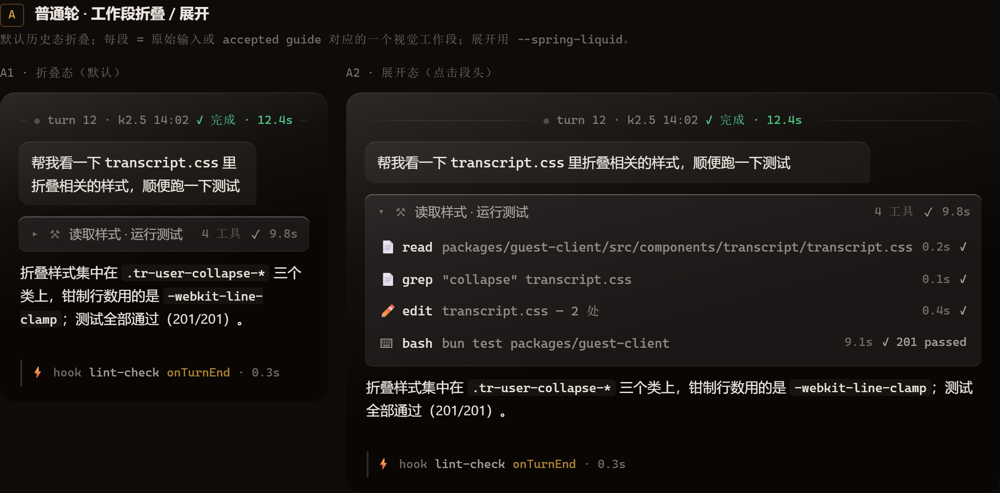
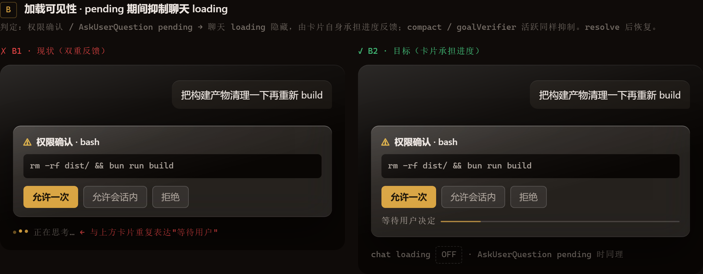
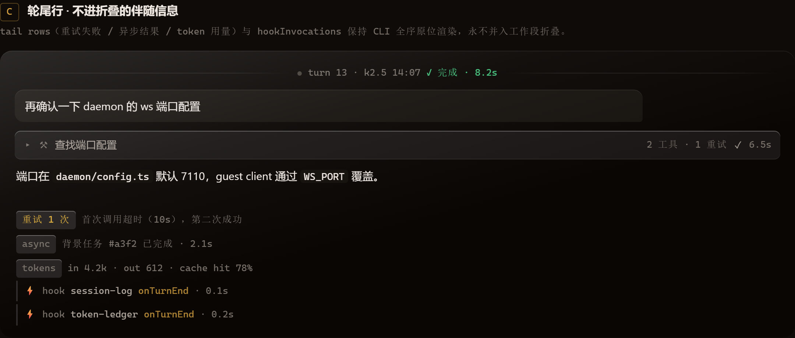
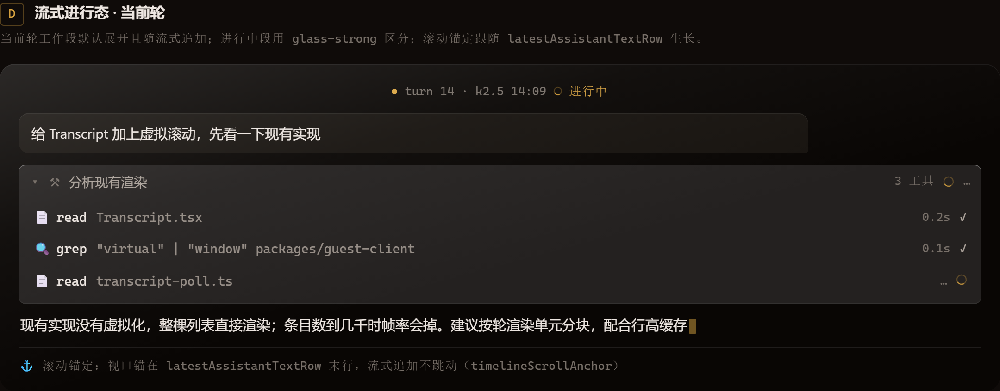

# M1 · 会话消息渲染 — 视觉设计稿 v1（送审稿）

> 0.5.0 路线图 M1.8 交付物。参照 ZCode v4 轮渲染单元语义
>（`zcode/packages/ui/src/v4/conversationTurnRenderUnits.ts`），
> 对 `guest-client` Transcript 的四个视觉态给出高保真设计稿与交互契约。
> **评审通过后，视觉实现才能动工**（设计稿先行硬纪律）。
>
> - Mockup 源文件：`docs/review/0.5.0-m1-transcript-design/mockup.html`（自包含，浏览器直接打开）
> - 全部视觉值取自 `packages/client-core/src/styles/tokens.css` 暗色段，未发明任何新 token

---

## 0. 设计基线

| 项 | 值 | 来源 |
|---|---|---|
| 背景 | `--bg oklch(0.155 0.008 60)` / `--bg-inset 0.125` | tokens.css |
| 前景 | `--fg 0.93` / `--fg-muted 0.72` / `--fg-faint 0.55` | tokens.css |
| 品牌 accent | `oklch(0.7507 0.1295 79.85)` = #d9a441 金 | tokens.css，禁止改 |
| 状态色 | `--ok` 青绿 / `--warn` 琥珀 / `--err` 红 | tokens.css |
| 玻璃面 | `--glass-bg(7%)` + `--glass-bg-strong(11%)`，rim = `inset box-shadow`（不用 border），sheen 走 `::before` | tokens.css §liquid-glass |
| 模糊 | `blur(3xl)=24px saturate(170%)`（浮层） | tokens.css §blur ladder |
| 圆角 | 阶梯变量 `--r-xs…--r-2xl`，禁字面 px | tokens.css |
| 动效 | `--spring-liquid = cubic-bezier(.34,1.56,.64,1)`（展开/菜单/按压） | tokens.css |
| 字体 | Inter Variable（UI）/ JetBrains Mono Variable（数据行） | tokens.css |

**与现状的关系**：Transcript 已有一层"pre-compaction 折叠"（`collapseCompacted`，把压缩前历史折到 divider 后面）。本设计稿新增的是**轮级工作段折叠**——两者独立共存：前者按时间（压缩点）切，后者按语义（一轮内的工作过程）切。

---

## A · 普通轮：工作段折叠 / 展开



**结构（对齐 ZCode `ConversationTurnRenderUnit`）**：

```
turn
├── turn header        轻边界：turn 序号 · 模型 · 时间 · 聚合状态(✓完成/进行中 + 耗时)
├── user bubble        现有 tr-user 语言，不改
├── workSegments[]     语义折叠单元 —— 本设计稿核心新增
│    折叠态(默认历史)  单行：chevron + 段摘要 + 工具数 + 段状态 + 段耗时
│    展开态            工具行全序列表（read/grep/edit/bash…，各自状态+耗时）
├── latestAssistantTextRow  轮尾最终正文（复制/重试/分支操作栏挂这里）
├── tail rows          重试失败 / 异步结果 / token 用量 —— 永不进折叠
└── hookInvocations    hook 行（mono 细条，左边线）—— 永不进折叠
```

**折叠边界规则**：

1. **段的划分**：原始输入、每条 accepted guide 各对应一个独立视觉工作段（ZCode `workSegments` 语义）；段内保持 CLI row 全序。
2. **默认态**：历史轮一律折叠；**当前轮**的工作段默认展开并随流式追加（见 D）。
3. **聚合状态**取段内最差状态：任一 err → 段标 err；否则有 running → running；否则 ✓。耗时为段内工具耗时之和。
4. 折叠的是"工作过程"，不是"信息"：`latestAssistantTextRow`、tail rows、hook 行、用户气泡一律不参与折叠。
5. 展开/收起动画用 `--spring-liquid`（0.25s），chevron 旋转同步。

---

## B · 加载可见性：pending 期间抑制聊天 loading



**问题**：现状中权限确认卡 pending 时，聊天底部 loading 仍在跑——"等待用户决定"和"正在思考"两个信号互相矛盾。

**判定表（映射到现有组件/事件）**：

| 状态 | 聊天 loading | 进度反馈由谁承担 | 我们的挂接点 |
|---|---|---|---|
| 权限确认 pending | **隐藏** | ApprovalCard 自身的"等待用户决定"进度线 | `components/shell/ApprovalCard.tsx` |
| AskUserQuestion pending | **隐藏** | 提问卡自身 | Transcript custom_message 提问分支 |
| compact 进行中 | **隐藏** | compaction divider 已有专属呈现（`entry.type === "compaction"`） | Transcript.tsx:946 |
| goalVerifier 活跃 | **隐藏** | verifier 卡片自身 | 待确认 guest-client 暴露点（M1.1 调查项） |
| 正常流式 | 显示 | 聊天 loading + 流式 caret | 现有 |
| pending resolve 后 | 恢复显示 | — | — |

**卡片进度线规范**：卡片底部一条 2px 进度线（`--glass-border` 轨道 + accent 40% 滑块，`plslide 1.6s var(--spring-liquid)` 无限），文案 "等待用户决定"。卡片本身已是 glass 浮层（blur-3xl + glass-shadow），进度线不再额外加边框。

---

## C · 轮尾行与 Hook 行：不进折叠的伴随信息



- **tail rows**（`assistantTailRows`）：重试失败（warn chip + 原因）、异步结果、token 用量——保持 CLI 全序原位渲染，chip 用 `--glass-bg-strong` + inset rim。
- **hookInvocations**：turn-local，mono 细条 + 2px 左边线（`--glass-border`），`hook 名 · 事件 · 耗时`；hover 出详情 action。**永不并入工作段折叠**，因为 hook 是轮的"事后审计信息"，不是工作过程。

---

## D · 流式进行态：当前轮



- turn header 的圆点变为 accent 色 + 旋转 spinner + "进行中"；耗时显示 `…`。
- 当前轮工作段默认展开（`.tr-seg--open.tr-seg--live`：`--glass-bg-strong` 底，与历史段的 `--glass-bg` 区分），工具行随流式实时追加。
- 进行中的工具行：spinner + `…` 耗时；已完成的行立即转为 ✓ + 实际耗时。
- **滚动锚定**：视口锚在 `latestAssistantTextRow` 末行，流式文本生长时视口不跳动（ZCode `timelineScrollAnchor` 语义；我们现有 `tr-window-top` spacer + nonce 机制的基础上补锚定逻辑）。
- 流式 caret：8px × 1.1em accent 块，0.9s steps(2) 闪烁，挂在生长末尾。

---

## 待评审决策点

1. **turn header 信息密度**：目前放 `turn 序号 · 模型 · 时间 · 状态+耗时`，是否保留模型名？（多模型切换场景有用，单模型场景是噪声）
2. **段摘要文案**：折叠态摘要目前由工具数+首工具名自动生成，是否需要 i18n 模板句（如"读取样式 · 运行测试"这种动词概括）？生成来源是 LLM 摘要还是规则拼接，影响成本。
3. **token 用量行**：C 中的 tokens tail row 是否在 settings 里给开关（默认开还是关）？
4. **hook 行默认可见性**：全部展示会拉长轮尾，是否默认折成一行 "N 个 hook · 展开"？

---

## 评审通过后动工清单（预览）

- `transcript/render-units.ts` 纯函数层（M1.1，不涉视觉，可先行）
- `Transcript.tsx` 渲染层按本稿重构 + `transcript.css` 新增 `.tr-turn/.tr-seg/.tr-tail/.tr-hook` 系列
- ApprovalCard 进度线 + loading 可见性收敛
- 滚动锚定（timelineScrollAnchor 移植）

---

## 实装验证（2026-09-21 · mock-host 真实会话截图）

设计稿已落地并通过 `verify-live.py`（mock-host fixture 会话 + guest-client dev server + headless Chromium 深链加入）截图验证，产物在 `shots/live/`：

- **折叠态**（`transcript-live.png`）：turn header  hairline·圆点·第 N 轮·模型名·时间·状态+耗时 全要素渲染；工作段折叠为 "活动 · 摘要" 单行；tail 行（文本回复）原位渲染不被折叠吞掉。
- **展开态**（`transcript-fold-open.png`）：点击折叠条展开，思考子段、markdown 正文、代码块、工具行（bash/read，含耗时与 token 信息）按全序呈现。
- 验证脚本自身两处修复：collab link 本身即 URL fragment（无 `#`，脚本原先误截断）；Windows 下子进程改 `kill()`（CTRL_BREAK 无独立进程组会误杀父进程）。
- 剩余：M1.3 滚动锚定（timelineScrollAnchor 语义）未做；D 流式进行态的 live 截图待真实流式会话补充（fixture 为已完成态）。
